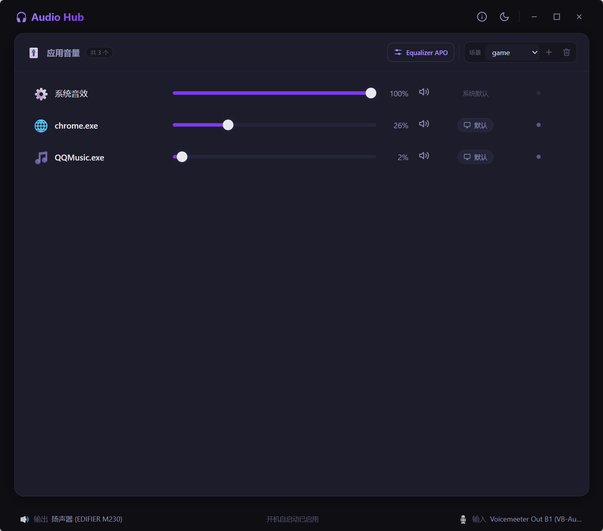
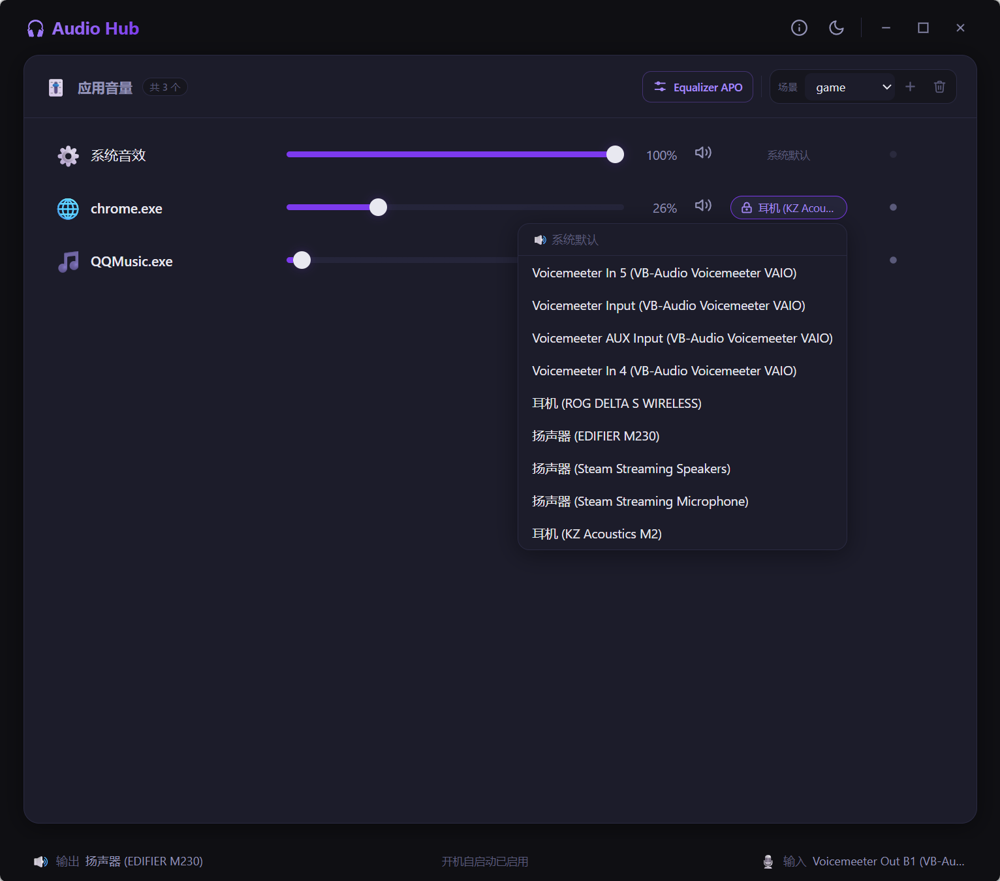
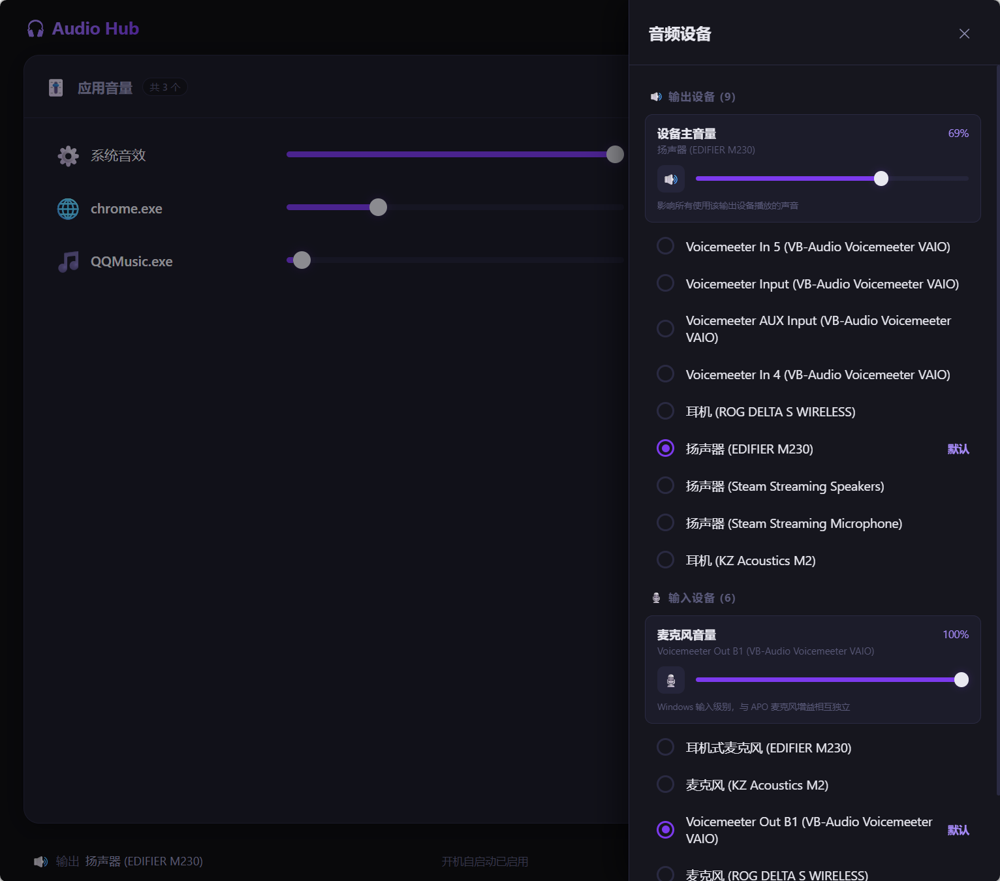
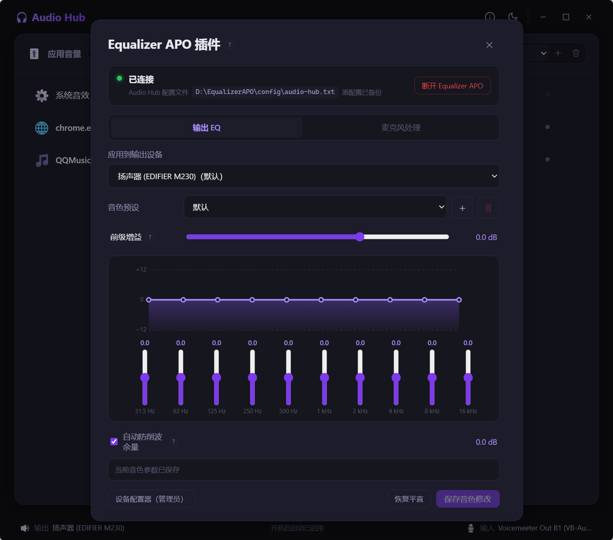
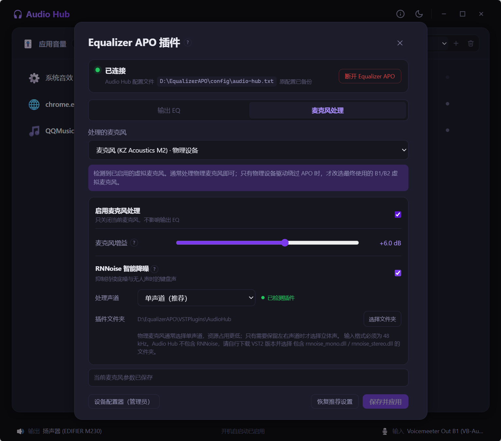

# Audio Hub

> 面向 Windows 游戏玩家的轻量级音频控制中心。

> 由 **Juice** 发起，并借助 **OpenAI Codex** 与 **Claude Code** 完成设计、开发与迭代。

Audio Hub 使用 Rust、Tauri 2 和 Windows WASAPI 构建，将应用音量、设备切换、
应用输出路由、音量场景以及 Equalizer APO 调音功能集中在一个界面中。
基础音频管理无需安装任何虚拟声卡或第三方插件。

当前版本：`0.2.0`

## 界面预览

### 应用音量与音量场景

集中管理系统音效和各个应用的音量、静音、输出设备及音量场景。



### 应用输出路由

为单个应用选择独立的输出设备，或随时恢复使用系统默认设备。



### 音频设备与设备音量

切换默认输出设备和麦克风，并直接调节当前默认设备的主音量。



### Equalizer APO 输出 EQ

为不同输出设备保存独立的十段 EQ 音色预设，并提供前级增益和自动防削波余量。



### 麦克风处理与 RNNoise

为麦克风设置输入增益，并调用用户提供的 RNNoise VST2 插件进行智能降噪。



## 功能概览

### 应用音量管理

- 枚举所有活跃输出设备上的 Windows 音频会话。
- 独立调节每个应用的音量和静音状态。
- 通过进程快照识别应用名称，兼容无法直接读取进程信息的受保护程序。
- 支持隐藏不常用的会话，并在应用重启后保持隐藏状态。
- 设备、会话和音量变化优先使用 Windows 系统事件通知刷新。
- 系统事件不可用时自动降级为低频轮询。

### 音频设备与应用路由

- 查看所有活跃输出设备和输入设备。
- 切换 Windows 默认输出设备和默认麦克风。
- 在设备抽屉中调节当前默认输出设备主音量和麦克风输入音量。
- 支持设备级静音；拖动到非零音量时自动解除静音。
- 为单个应用指定输出设备，或恢复使用系统默认设备。
- 应用输出路由按稳定应用名称保存，应用重启后仍可恢复。
- 插拔耳机、音箱和麦克风时自动刷新设备列表。

### 音量场景

- 创建“FPS”“电影”“会议”等独立音量场景。
- 场景保存当前应用的音量和静音状态。
- 调整应用音量后自动保存到当前场景。
- 切换场景时立即恢复对应音量。
- 应用 PID 改变后，可通过应用名称重新匹配。
- 启动 Audio Hub 时恢复上次选择的场景。

音量场景只负责应用音量和静音。应用输出路由及 Equalizer APO 音色均独立保存，
切换场景不会改变设备路由或 EQ。

### 应用声音录制

- 使用 Windows Process Loopback 捕获指定应用及其子进程的声音。
- 同一时间只录制一个应用。
- 输出 `48 kHz / 双声道 / 16-bit` WAV 文件。
- 录制完成后可直接在资源管理器中定位文件。
- 需要 Windows Build `20348` 或更高版本；低版本系统会自动禁用录制按钮。

### Equalizer APO 输出 EQ（可选）

Audio Hub 不捆绑或静默安装 Equalizer APO。未安装时，其余功能仍可正常使用。

- 自动检测 Equalizer APO 安装位置和连接状态。
- 可打开官方下载页和需要 UAC 确认的设备配置器。
- 输出、输入选择框只显示已在 Equalizer APO 设备配置器中启用的端点。
- 使用独立的 `audio-hub.txt` 管理配置。
- 首次连接时备份原始 `config.txt`。
- 断开连接只停止 Audio Hub 的处理，不卸载 Equalizer APO，也不删除已保存参数。
- Audio Hub 关闭后，已保存的处理仍由 Equalizer APO 在后台生效。

输出 EQ 功能：

- 按输出设备分别保存参数。
- 10 段图形均衡器：
  `31.5 / 63 / 125 / 250 / 500 / 1k / 2k / 4k / 8k / 16k Hz`。
- 实时频率响应曲线。
- 前级增益和自动防削波余量。
- 一键恢复平直。
- 每个输出设备可创建、切换和删除多个音色预设。
- 切换预设立即生效；只有修改预设参数后才需要保存。
- 切换页面、设备或预设时保护未保存的修改。

### 麦克风处理（可选）

- 按输入设备分别保存处理参数。
- 调节麦克风增益，范围为 `-12 dB` 至 `+18 dB`。
- 可单独关闭某个麦克风的处理，不影响输出 EQ。
- 支持 RNNoise VST2 智能降噪。
- 支持单声道 `rnnoise_mono.dll` 和立体声 `rnnoise_stereo.dll`。
- 可在界面中选择 RNNoise DLL 所在文件夹。
- 自动标识物理麦克风和常见虚拟麦克风。
- 只有检测到已启用 APO 的虚拟麦克风时才显示相关使用提示。

RNNoise 需要用户自行下载，Audio Hub 不分发插件文件。使用 RNNoise 时，请将
Windows 麦克风格式设置为 `48 kHz`。

### 其他

- 深色、浅色双主题。
- 无边框窗口和自定义窗口控制。
- 可在“关于”中启用或关闭当前 Windows 用户的登录自启动。
- 本地运行，无账号、云端同步或遥测。

## 系统要求

| 功能 | 要求 |
|---|---|
| 基础音量和设备管理 | Windows 10 或 Windows 11 |
| 界面运行 | Microsoft WebView2 Runtime，Windows 10/11 通常已预装 |
| 应用声音录制 | Windows Build 20348 或更高 |
| 输出 EQ / 麦克风增益 | 用户自行安装 Equalizer APO |
| RNNoise 智能降噪 | Equalizer APO、48 kHz 输入格式及用户提供的 VST2 DLL |

## 快速开始

### 基础音频管理

1. 安装并启动 Audio Hub。
2. 启动需要管理的游戏、浏览器或音乐播放器。
3. 在主页面调整应用音量、静音或输出设备。
4. 点击底部输出或输入设备，打开设备抽屉。
5. 在抽屉中切换默认设备，并调整当前默认设备或麦克风音量。
6. 通过顶部“场景”控件创建和切换音量场景。

### 接入 Equalizer APO

1. 安装 Equalizer APO。
2. 在 Equalizer APO 设备配置器中勾选需要处理的输出设备或麦克风。
3. 根据安装程序提示重启 Windows 或音频设备。
4. 打开 Audio Hub 的“Equalizer APO”页面。
5. 确认设备列表只包含已启用 APO 的端点。
6. 点击“连接 Equalizer APO”。
7. 在“输出 EQ”或“麦克风处理”页面保存并应用参数。

连接后，界面会显示 Audio Hub 配置文件的实际保存位置和原配置备份状态。

### 使用 RNNoise

1. 准备 `rnnoise_mono.dll` 或 `rnnoise_stereo.dll`。
2. 将麦克风的 Windows 输入格式设置为 `48 kHz`。
3. 进入“Equalizer APO → 麦克风处理”。
4. 点击“选择文件夹”，选择直接包含 DLL 的目录。
5. 选择可用的处理声道，启用 RNNoise 后保存并应用。

## 配置与安全

- 音量场景保存在 `%APPDATA%\audio-hub\profiles\`。
- 隐藏会话、主题、上次场景及应用路由保存在 WebView 本地数据中。
- Equalizer APO 参数保存在 Audio Hub 应用数据目录，并渲染到
  Equalizer APO 的 `audio-hub.txt`。
- Audio Hub 只在 Equalizer APO 主配置中维护一段带明确标记的
  `Include: audio-hub.txt`。
- 第一次连接时创建 `config.audio-hub.backup.txt`。
- 自启动使用
  `HKCU\Software\Microsoft\Windows\CurrentVersion\Run`，
  只影响当前 Windows 用户，不需要管理员权限。

如果准备卸载 Audio Hub，建议先在插件页面点击“断开 Equalizer APO”。

## 当前功能边界

- 不提供虚拟声卡、ASIO 或复杂音频矩阵。
- 不包含将应用声音流转到虚拟麦克风的功能。
- 不提供单应用实时 EQ；当前 EQ 作用于 Equalizer APO 已启用的输出设备。
- 不捆绑 Equalizer APO 或 RNNoise。
- 当前正式打包目标为 NSIS 安装包；免安装版本需要作为独立发布物构建。

## 开发

### 环境

- Windows 10/11
- Rust stable
- Node.js 与 npm
- Microsoft WebView2 Runtime

### 安装依赖

```powershell
npm install
```

### 开发运行

```powershell
npx tauri dev
```

请使用 `npx tauri dev` 启动开发版，以避免直接运行调试 EXE 时读取旧的 WebView2
前端缓存。

### 检查

```powershell
node --check frontend/js/app.js
node --check frontend/js/api.js
cargo test --manifest-path src-tauri/Cargo.toml
cargo clippy --manifest-path src-tauri/Cargo.toml --all-targets -- -D warnings
```

### 构建安装包

```powershell
npx tauri build
```

## 技术栈

- Rust 2024
- Tauri 2
- `windows-rs` / WASAPI / Windows Core Audio
- 原生 HTML、CSS 和 JavaScript
- Equalizer APO 文本配置集成

## 项目结构

```text
audio-hub/
├─ frontend/                    # HTML、CSS、JavaScript 界面
├─ src-tauri/src/audio/         # WASAPI、通知、场景和进程录制
├─ src-tauri/src/plugins/       # Equalizer APO 集成
├─ src-tauri/src/autostart.rs   # Windows 当前用户自启动
├─ archive/                     # 已归档、未参与编译的实验模块
└─ src-tauri/tauri.conf.json    # Tauri 窗口和 NSIS 打包配置
```

## 开源协议

Audio Hub 使用 [MIT License](LICENSE) 开源。

Equalizer APO、RNNoise 插件及其他第三方组件保留各自的许可证和版权；
Audio Hub 不捆绑分发这些可选组件。
